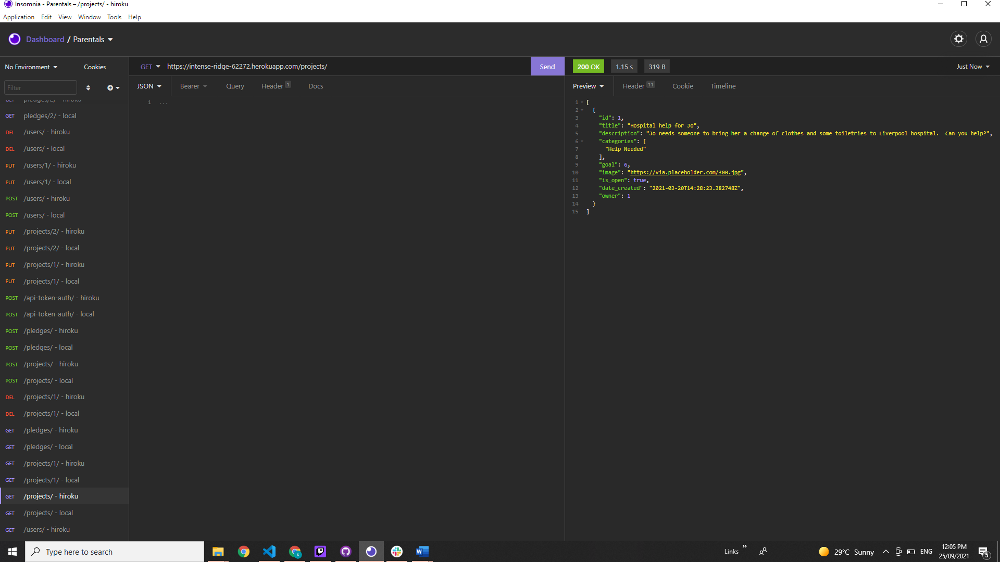
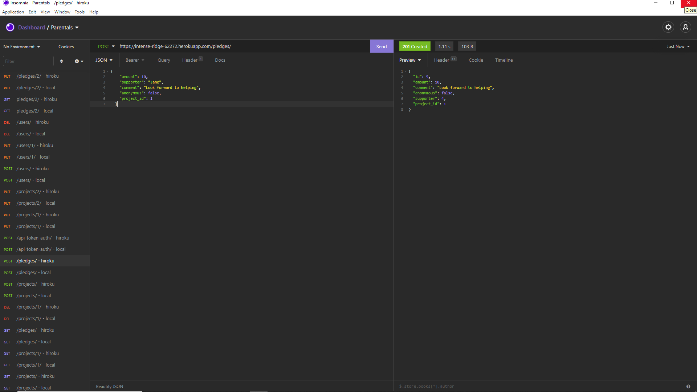
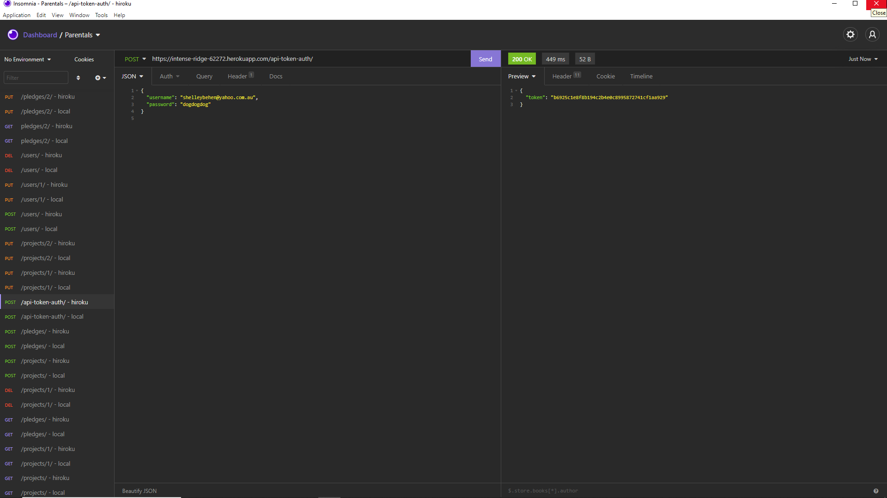
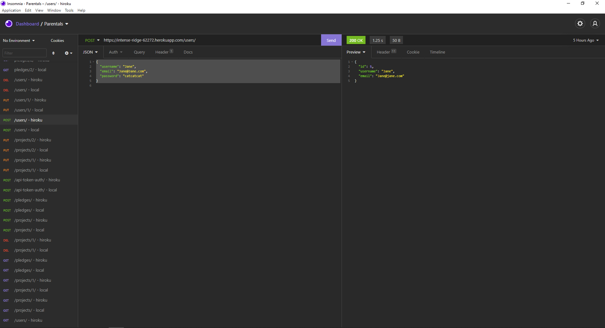
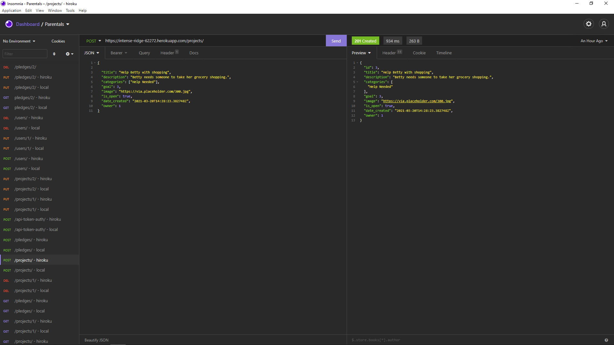
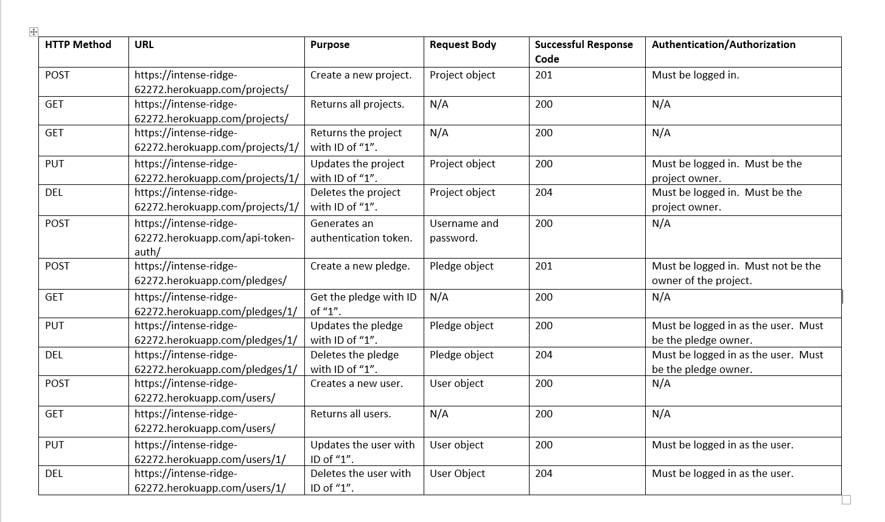
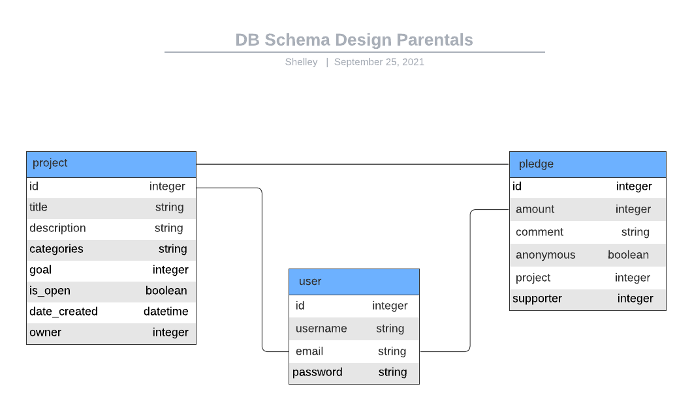

# Parentals
Django Rest Framework Project

Link to deployed project [https://intense-ridge-62272.herokuapp.com/projects/](https://intense-ridge-62272.herokuapp.com/projects/)

## Setup/Instructions

Git clone the repository [https://github.com/shelleybehen/Parentals](https://github.com/shelleybehen/Parentals)

Setup the virtual environment and install dependencies:
 - python3 --version to ensure you have python 3.6+ installed
 - virtualenv --version
 - python -m virtualenv venv
 - source venv/Scripts/activate
 - python -m pip install --upgrade pip
 - pip install -r requirements.txt
  
Start the server for the first time

Download and install Insomnia
## API Endpoints
Projects - https://intense-ridge-62272.herokuapp.com/projects/

Pledges - https://intense-ridge-62272.herokuapp.com/pledges/

Users - https://intense-ridge-62272.herokuapp.com/users/

Screenshot displaying successful GET method for https://intense-ridge-62272.herokuapp.com/projects/ endpoint

Screenshot displaying successful POST method for https://intense-ridge-62272.herokuapp.com/pledges/ endpoint

Screenshot demonstrating successful token being returned for https://intense-ridge-62272.herokuapp.com/api-token-auth/ endpoint

## How to register a new user

1. Navigate to https://intense-ridge-62272.herokuapp.com/users/
2. Enter username, email and password into the 'Content' field:
   
   {
	"username": "Jane",
	"email": "Jane@Jane.com",
	"password": "catcatcat"
}

3. Click on the 'Send' button
4. Successful HTTP 200 OK message is returned:

## How to create a new project:

1. Navigate to https://intense-ridge-62272.herokuapp.com/projects/
2. Enter project title, description, category, goal, image link, open status, date created and owner into the 'Content' field:
   {
 
  "title": "Help Betty with shopping",
  "description": "Betty needs someone to take her grocery shopping.",
	"categories": ["Help Needed"],
  "goal": 3,
  "image": "https://via.placeholder.com/300.jpg",
  "is_open": true,
  "date_created": "2021-03-20T14:28:23.382748Z",
  "owner": 1
}
3. Click on the 'Send' button
4. Successful HTTP 201 Created message is returned:

## API Specification

## DB Schema Design

